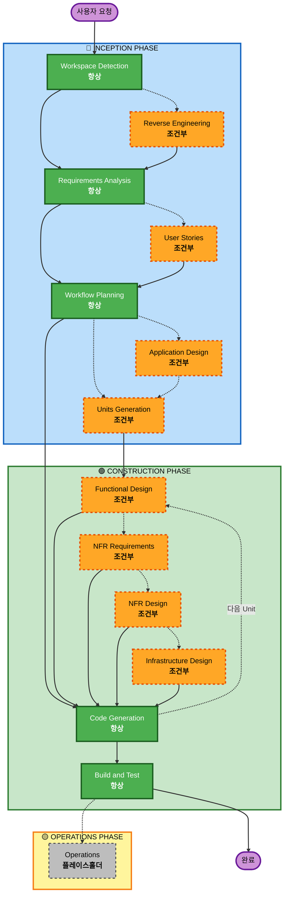

# AI-DLC 적응형 Workflow 개요

**목적**: AI 모델과 개발자가 완전한 workflow 구조를 이해하기 위한 기술적 참조.

**참고**: 유사한 내용이 core-workflow.md (사용자 환영 메시지)와 README.md (문서화)에 존재합니다. 이 중복은 의도적입니다 - 각 파일은 다른 목적을 제공합니다:
- **이 파일**: AI 모델 컨텍스트 로딩을 위한 Mermaid 다이어그램이 있는 상세 기술 참조
- **core-workflow.md**: ASCII 다이어그램이 있는 사용자 대면 환영 메시지
- **README.md**: 저장소를 위한 사람이 읽을 수 있는 문서화

## 3단계 생명주기:
• **INCEPTION PHASE**: 계획 및 아키텍처 (Workspace Detection + 조건부 phase들 + Workflow Planning)
• **CONSTRUCTION PHASE**: 설계, 구현, 빌드 및 테스트 (per-unit 설계 + Code Planning/Generation + Build & Test)
• **OPERATIONS PHASE**: 향후 배포 및 모니터링 workflow를 위한 플레이스홀더

## 적응형 Workflow:
• **Workspace Detection** (항상) → **Reverse Engineering** (brownfield만) → **Requirements Analysis** (항상, 적응형 깊이) → **조건부 Phase들** (필요시) → **Workflow Planning** (항상) → **Code Generation** (항상, per-unit) → **Build and Test** (항상)

## 작동 방식:
• **AI가 분석**: 귀하의 요청, workspace, 복잡성을 분석하여 필요한 stage들을 결정
• **이 stage들은 항상 실행**: Workspace Detection, Requirements Analysis (적응형 깊이), Workflow Planning, Code Generation (per-unit), Build and Test
• **다른 모든 stage들은 조건부**: Reverse Engineering, User Stories, Application Design, Units Generation, per-unit 설계 stage들 (Functional Design, NFR Requirements, NFR Design, Infrastructure Design)
• **고정된 순서 없음**: Stage들은 특정 작업에 맞는 순서로 실행

## 팀의 역할:
• **질문에 답변**: 전용 질문 파일에서 [Answer]: 태그를 사용하여 문자 선택 (A, B, C, D, E)으로 답변
• **옵션 E 사용 가능**: 제공된 옵션이 맞지 않으면 "Other"를 선택하고 사용자 정의 응답 설명
• **팀으로 작업**: 진행하기 전에 각 phase를 검토하고 승인
• **집단적 결정**: 필요시 아키텍처 접근법에 대해 집단적으로 결정
• **중요**: 이것은 팀 노력입니다 - 각 phase에 관련 이해관계자들을 참여시키세요

## AI-DLC 3단계 Workflow:

**Stage 설명:**

**🔵 INCEPTION PHASE** - 계획 및 아키텍처
- Workspace Detection: workspace 상태와 프로젝트 유형 분석 (항상)
- Reverse Engineering: 기존 codebase 분석 (조건부 - Brownfield만)
- Requirements Analysis: 요구사항 수집 및 검증 (항상 - 적응형 깊이)
- User Stories: user stories와 personas 생성 (조건부)
- Workflow Planning: 실행 계획 생성 (항상)
- Application Design: 고수준 컴포넌트 식별 및 서비스 레이어 설계 (조건부)
- Units Generation: units of work로 분해 (조건부)

**🟢 CONSTRUCTION PHASE** - 설계, 구현, 빌드 및 테스트
- Functional Design: unit별 상세 비즈니스 로직 설계 (조건부, per-unit)
- NFR Requirements: NFR 결정 및 기술 스택 선택 (조건부, per-unit)
- NFR Design: NFR 패턴과 논리적 컴포넌트 통합 (조건부, per-unit)
- Infrastructure Design: 실제 인프라 서비스에 매핑 (조건부, per-unit)
- Code Generation: Part 1 - Planning, Part 2 - Generation으로 코드 생성 (항상, per-unit)
- Build and Test: 모든 unit 빌드 및 포괄적 테스트 실행 (항상)

**🟡 OPERATIONS PHASE** - 플레이스홀더
- Operations: 향후 배포 및 모니터링 workflow를 위한 플레이스홀더 (플레이스홀더)

**핵심 원칙:**
- Phase들은 가치를 더할 때만 실행
- 각 phase는 독립적으로 평가
- INCEPTION은 "무엇을"과 "왜"에 초점
- CONSTRUCTION은 "어떻게"와 "빌드 및 테스트"에 초점
- OPERATIONS는 향후 확장을 위한 플레이스홀더
- 단순한 변경은 조건부 INCEPTION stage들을 건너뛸 수 있음
- 복잡한 변경은 전체 INCEPTION과 CONSTRUCTION 처리를 받음